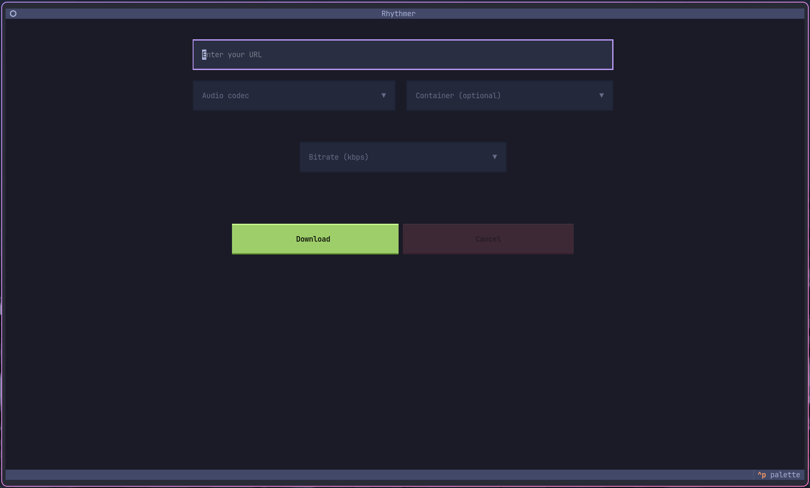

# Siphon is a TUI audio/video downloader based on yt-dlp

[](https://python.org)
[](LICENSE)
[]()
[](https://github.com/Textualize/textual)
[](https://docs.astral.sh/ruff/)

A modern terminal-based media downloader with interactive UI, built with Python and Textual. Download high-quality audio and video from YouTube, SoundCloud, and [1000+ other platforms](https://github.com/yt-dlp/yt-dlp/blob/master/supportedsites.md) with automatic metadata embedding and thumbnail support. Powered by yt-dlp.



## ✨ Features

- **Interactive TUI** — Dropdown selectors, real-time notifications, cancel support
- **Audio Formats** — MP3, AAC, FLAC, M4A, Opus, Vorbis, WAV with configurable bitrate (64–320 kbps)
- **Video Formats** — MP4, MKV, WebM, MOV, AVI, FLV with automatic audio codec selection
- **Smart Codec Mapping** — Automatically pairs containers with optimal audio codecs (e.g., MP4→AAC, MKV→Opus)
- **Metadata Embedding** — Title, artist, album tags + cover art thumbnails
- **Thread-safe** — Responsive UI during downloads with background processing

## 🚀 Quick Start

### Prerequisites
- Python 3.10+ & FFmpeg

### Installation

#### 1. Clone Repository

```bash
git clone https://github.com/Fkernel653/Siphon.git && cd Siphon
```

#### 2. Install Dependencies

**uv** (recommended)
```bash
uv sync
```

**pip**
```bash
pip install .
```

**Poetry**
```bash
poetry install
```

**PDM**
```bash
pdm install
```

### Usage
```bash
# Set download directory (optional, defaults to home directory)
python add_path.py

# Launch TUI
python main.py
```

If you skip `add_path.py`, files will be saved to your home directory (`~` or `$HOME`).

## ⌨️ Controls

| Key | Action |
|-----|--------|
| `Tab` | Navigate between fields |
| `Enter` | Confirm selection / Start download |
| `Esc` | Close dropdown |
| `Ctrl+C` | Exit application |

## 📁 Structure

```
Siphon/
├── main.py             # TUI entry point and UI logic
├── add_path.py         # Path configuration tool (optional)
├── style.tcss          # Layout and spacing styles
├── config.json         # User settings (download path)
├── pyproject.toml      # Project metadata and dependencies
├── README.md           # Project documentation
├── screenshot.png      # Application screenshot
└── modules/
    ├── download.py     # Download logic with progress tracking
    ├── configer.py     # Configuration management (read/write settings)
    └── colors.py       # Terminal color definitions
```

## 🔧 Requirements

| Package | Purpose |
|---------|---------|
| `textual` | TUI framework for interactive terminal apps |
| `yt-dlp` | Media extraction from 1000+ platforms |
| `mutagen` | Audio metadata tagging and cover art embedding |
| `FFmpeg` | Audio/video conversion and post-processing |

## ⚙️ Configuration

The download path is stored in `config.json` and can be set via:

```bash
python add_path.py
```

If no custom path is configured, downloads will be saved to your home directory by default.

## 📄 License

MIT License — see [LICENSE](LICENSE).

## 🙏 Acknowledgments

- [Textual](https://github.com/Textualize/textual) – Modern TUI framework
- [yt-dlp](https://github.com/yt-dlp/yt-dlp) – Feature-rich media downloader
- [mutagen](https://github.com/quodlibet/mutagen) – Python multimedia tagging library
- [FFmpeg](https://ffmpeg.org) – Complete multimedia solution

## ⚠️ Disclaimer

**For educational purposes only.** Users are responsible for complying with platform Terms of Service and applicable copyright laws. Download only content you have permission to download.

---

**Author:** [Fkernel653](https://github.com/Fkernel653)  
**Repository:** [github.com/Fkernel653/Siphon](https://github.com/Fkernel653/Siphon)
